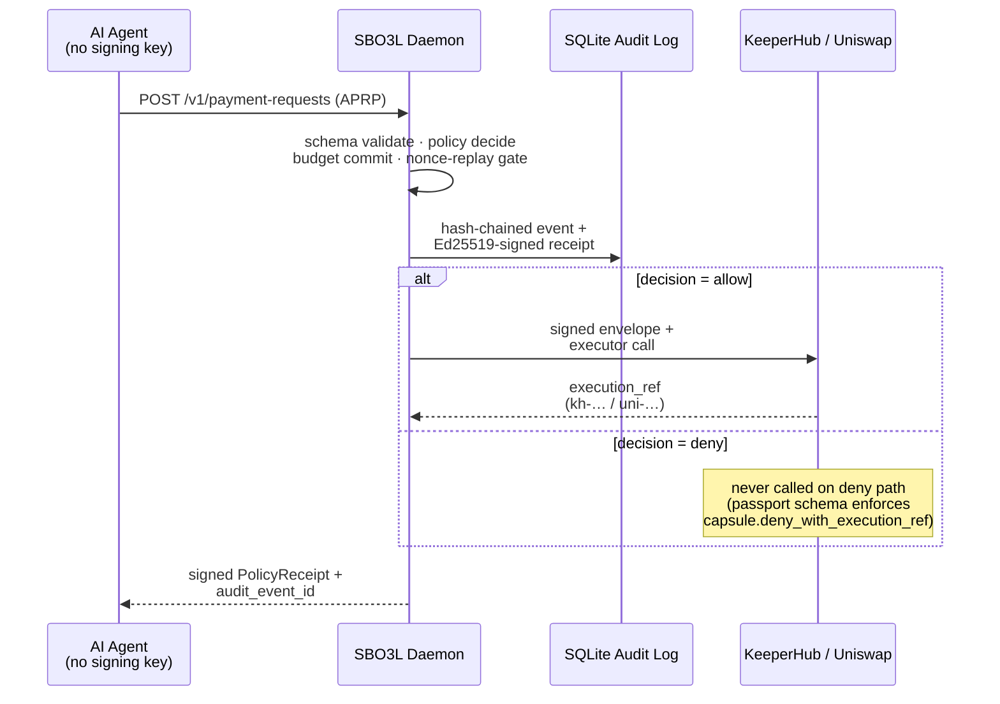

# SBO3L

> Don't give your agent a wallet. Give it a mandate.

**SBO3L** is a local policy, budget, receipt and audit firewall that decides whether an autonomous AI agent may execute an onchain or payment action. The agent never holds a private key. SBO3L decides, signs and audits.

This repository was implemented during **ETHGlobal Open Agents 2026**. Planning and specification artifacts under [`docs/spec/`](docs/spec/) were copied from a pre-hackathon planning repository (`agent-vault-os`) and are clearly labelled — they are not prior product code.

---

## Status

**Implemented and reproducible from a fresh clone.** `cargo test --workspace --all-targets` runs **377/377 green**. `bash demo-scripts/run-openagents-final.sh` runs all **13 demo gates** end-to-end clean in ~10 seconds. `bash demo-scripts/run-production-shaped-mock.sh` exercises the production-shaped surface (HTTP `Idempotency-Key` four-case matrix + `sbo3l doctor` + mock-KMS CLI lifecycle + active-policy lifecycle + **audit checkpoint create/verify with mock anchoring** + audit-bundle round-trip + the operator-evidence transcript consumed by the operator console + the Passport capsule emit/verify pair) end-to-end with **Tally: 26 real, 0 mock, 1 skipped** (only the optional `--include-final-demo` flag remains on the SKIPPED list — every A-side backlog item has merged). The MCP-callable SBO3L gateway (`crates/sbo3l-mcp/`, P3.1), the IP-1 KeeperHub envelope helper (`sbo3l_keeperhub_adapter::build_envelope`, P5.1), and the publishable workspace crate `crates/sbo3l-keeperhub-adapter` (IP-4) are present; judge-facing integration walk-through in [`docs/mcp-integration-guide.md`](docs/mcp-integration-guide.md). See [`IMPLEMENTATION_STATUS.md`](IMPLEMENTATION_STATUS.md) for the current snapshot.

## Verify the demo

Public proof URL (deployed from `main` by [`.github/workflows/pages.yml`](.github/workflows/pages.yml)): **<https://b2jk-industry.github.io/SBO3L-ethglobal-openagents-2026/>** — landing page links to the trust-badge proof viewer, the operator-console evidence panels, and a downloadable Passport capsule (`sbo3l.passport_capsule.v1`) you can verify offline with `sbo3l passport verify --path capsule.json`. The site is plain static HTML, no JavaScript, no client-side network calls; the `_site/` build is rendered from the same deterministic regression fixtures `python3 trust-badge/test_build.py` + `python3 operator-console/test_build.py` validate on every CI run, so the URL shows the same shape on every visit.

## Architecture in one diagram



The agent crate has **zero signing dependencies**: demo gate 12 grep-asserts that no `SigningKey` / `signing_key` references exist in `demo-agents/research-agent/`. All signing happens inside the SBO3L boundary; the agent only ever sees a signed receipt back.

## Three commands a judge needs

```bash
# 1. Run the full vertical demo (legit allow, prompt-injection deny, audit tamper detection, no-key proof, signed transcript).
bash demo-scripts/run-openagents-final.sh

# 2. Render the one-screen, judge-readable proof viewer (static HTML, no JS, no network).
python3 trust-badge/build.py
# then open trust-badge/index.html

# 3. Re-verify the proof viewer's regression test (stdlib-only).
python3 trust-badge/test_build.py
```

For a verifiable, offline-portable proof of a single decision, see [`docs/cli/audit-bundle.md`](docs/cli/audit-bundle.md): `sbo3l audit export` packages a signed receipt + audit chain prefix + signer keys into one JSON file; `sbo3l audit verify-bundle` re-derives every claim from that file alone.

## What SBO3L blocks

Each row below is a real adversarial input the daemon rejects fail-closed, verified end-to-end during the submission-window QA sweep. The exact error code SBO3L returns is the one a judge would see in their own terminal:

| Adversarial input | SBO3L response |
|---|---|
| Empty body | `HTTP 400` + `schema.missing_field` |
| Unknown field (e.g. `agent_says_it_is_safe`) | `HTTP 400` + `schema.unknown_field` |
| Reused APRP nonce | `HTTP 409` + `protocol.nonce_replay` |
| Prompt-injection request | `HTTP 200` + `decision=deny` + `policy.deny_unknown_provider` |
| Oversized payload (~100 KB) | `HTTP 400` (rejected before pipeline) |
| Same `Idempotency-Key` + different body | `HTTP 409` + `protocol.idempotency_conflict` |
| Audit-chain byte-flip | strict-hash verifier rejects (`rc=1`) |
| Capsule with mismatched `request_hash` | `capsule.request_hash_mismatch` (`rc=2`) |
| Capsule claiming live mode without evidence | `capsule.live_mode_empty_evidence` (`rc=2`) |
| Capsule claiming deny but carrying `execution_ref` | `capsule.deny_with_execution_ref` (`rc=2`) |
| All 9 tampered passport fixtures in `test-corpus/passport/` | every one rejected with `rc=2` |

Test surface backing these: **377 / 377 cargo tests** · **13 / 13 demo gates** · **8 / 8 HTTP adversarial fail-closed** · **9 tampered passport fixtures + manual byte-flip rejected**. `bash demo-scripts/run-openagents-final.sh` reproduces the audit-tamper detection gate end-to-end in ~10 seconds.

## What this is

- A Rust workspace implementing the **SBO3L** spending-mandate firewall for AI agents.
- A real research-agent demo harness that proves legitimate vs prompt-injection scenarios across the same boundary.
- Sponsor-facing adapters for **KeeperHub**, **ENS** and **Uniswap** with explicit `local_mock()` / `live()` constructors.
- Signed Ed25519 policy receipts and a hash-chained, tamper-evident audit log persisted in SQLite.
- A verifiable audit-bundle export and a static, offline trust-badge proof viewer.

## How SBO3L plugs into KeeperHub

> *KeeperHub executes. SBO3L proves the execution was authorised.*

SBO3L sits **in front of** KeeperHub as the policy / budget / signing / audit boundary. Allow receipts flow into `KeeperHubExecutor::execute()`; Deny receipts are refused before any sponsor call. Five concrete integration paths the KeeperHub team could merge or build on — `sbo3l_*` upstream-proof envelope fields (IP-1), submission JSON Schema (IP-2), `keeperhub.lookup_execution` MCP tool (IP-3), standalone `sbo3l-keeperhub-adapter` crate (IP-4), Passport capsule URI on the execution row (IP-5) — are catalogued in [`docs/keeperhub-integration-paths.md`](docs/keeperhub-integration-paths.md). Each is independently small, independently reviewable, and pointed at the place in this repo where the corresponding work lives.

The demo today always constructs `KeeperHubExecutor::local_mock()` (clearly disclosed); the live shape is documented end-to-end in [`docs/keeperhub-live-spike.md`](docs/keeperhub-live-spike.md) including the eight open questions for the KeeperHub team, the offline-CI test strategy, and the file-by-file shopping list for the live PR (~250 lines of Rust). On the MCP front the IP-3 **SBO3L side is implemented on `main`** — `sbo3l-mcp` (PR #46) exposes a stdio JSON-RPC `sbo3l.audit_lookup` tool symmetric to KeeperHub's proposed `keeperhub.lookup_execution`, so an MCP-aware auditor can cross-verify a KeeperHub `executionId` against a SBO3L audit bundle in two tool calls; judge-facing walk-through in [`docs/mcp-integration-guide.md`](docs/mcp-integration-guide.md). The KeeperHub side of the IP-3 pair remains target.

## Related work — how SBO3L differs

The "verifiable AI-agent action" space picked up sharply in 2026. SBO3L is one entry; this section names the closest neighbours we know about and says — without overclaiming — what each one does and where SBO3L sits next to them. The full per-axis matrix (signed receipts / hash-chained log / portable bundle / on-chain anchor / ENS discovery / policy-execution split / executor-evidence slot / MCP server / KeeperHub integration / language) lives in [`docs/comparison-with-related-work.md`](docs/comparison-with-related-work.md). **None of these projects are direct copies of each other** — they make different bets about where the trust boundary lives, what gets persisted, and which surfaces auditors actually call.

Where SBO3L sits relative to the field: most receipt-shaped projects (PEAC, Signet, ScopeBlind, agent-receipts/`ar`) sign the *decision*; SBO3L additionally carries a sponsor-specific **executor-evidence slot** (P6.1 `UniswapQuoteEvidence` today; the capsule schema's `execution.executor_evidence` is mode-agnostic so any sponsor can populate it), pairs the signed receipt with a hash-chained audit log, and wraps both into a single offline-verifiable Passport capsule. Most on-chain projects (ERC-8004, EAS) anchor identity or attestations; SBO3L stays off-chain by design — the audit chain is local and the "anchor" today is a deterministic `mock_anchor_ref` clearly labelled `mock anchoring, NOT onchain` (production-shaped runner exits non-zero on `mock_anchor: false`). The two design axes — *signed receipt + hash-chained log + executor evidence + offline capsule* (us) vs *on-chain attestation* (EAS / ERC-8004) — compose; we view them as complementary, not competing.

- **PEAC Protocol** — [github.com/peacprotocol/peac](https://github.com/peacprotocol/peac) / npm `@peac/protocol`. Standardised `peac.txt` policy file + Ed25519-JWS interaction receipts + portable `peac-bundle/0.1` evidence package; ships an `@peac/mcp-server`. **SBO3L differs:** SBO3L pairs each receipt with a hash-chained audit log and a sponsor-specific executor-evidence slot (e.g. `UniswapQuoteEvidence`); PEAC's bundle is the receipt + JWKS; SBO3L's Passport capsule is the receipt + chain prefix + executor evidence + ENS-resolved agent identity in one file.
- **Signet** — [github.com/Prismer-AI/signet](https://github.com/Prismer-AI/signet). Rust core, multi-language bindings, SHA-256 hash-chained signed receipts, `signet audit --bundle` exporter, MCP server. **SBO3L differs:** SBO3L's policy boundary is a *separable* engine (rules + budget + nonce-replay over schema-validated APRP) that can run without any signing surface; Signet bundles signing and policy enforcement at the receipt step. SBO3L also exposes a sponsor-side `KeeperHubExecutor` adapter pair so a guarded execution can route into a downstream workflow.
- **ScopeBlind / `protect-mcp`** — [github.com/scopeblind/scopeblind-gateway](https://github.com/scopeblind/scopeblind-gateway) (`npx protect-mcp`). Enterprise gateway that wraps any stdio MCP server, runs Cedar policy, signs decisions, exports an offline-verifiable bundle. **SBO3L differs:** SBO3L is built around APRP — a payment-shaped wire format with explicit `intent` / `amount` / `chain` / `expiry` — not a generic tool-call wrapper; the executor-evidence slot is type-checked per sponsor, not free-form. Cedar vs SBO3L's expression engine is a deliberate hackathon-grade simplification (Rego/`regorus` is the production target per `docs/spec/17_interface_contracts.md`).
- **agent-receipts / `ar`** — [github.com/agent-receipts/ar](https://github.com/agent-receipts/ar). Go MCP-proxy + TS / Python SDKs producing tamper-evident audit trails for agent actions; `Authorize → Act → Sign → Link → Audit` flow. **SBO3L differs:** SBO3L's audit log lives in SQLite (`audit_events` table, V003) with structural and strict-hash verifiers shipped, plus a DB-backed `audit export` path that pre-flights chain integrity and signatures before writing the bundle; `ar` describes the chain via the proxy but doesn't expose the SQL surface or DB-backed export path documented here.
- **ERC-8004 (Trustless Agents)** — [eips.ethereum.org/EIPS/eip-8004](https://eips.ethereum.org/EIPS/eip-8004), Ethereum mainnet (Jan 29 2026). Three on-chain registries (Identity / Reputation / Validation) for cross-org agent discovery. **SBO3L differs:** ERC-8004 is the discovery + validation layer; SBO3L is the per-decision policy + receipt + audit layer. Compatible: an ERC-8004 Identity Registry entry can carry a Passport capsule URI as one of its service references — that's IP-5 in [`docs/keeperhub-integration-paths.md`](docs/keeperhub-integration-paths.md).
- **EAS (Ethereum Attestation Service)** — [attest.org](https://attest.org) / [github.com/ethereum-attestation-service](https://github.com/ethereum-attestation-service). Open EVM protocol for registering schemas + signing on-chain or off-chain attestations. **SBO3L differs:** EAS is the on-chain notary; SBO3L is the off-chain decision firewall. A Passport capsule could itself be EAS-attested (`schemaId` = `sbo3l.passport_capsule.v1`) for callers who want an on-chain pointer. We don't ship that wiring today.
- **`mandate.md`** ([npm `@mandate.md/sdk`](https://www.npmjs.com/package/@mandate.md/sdk)) — TypeScript pre-transaction validator that catches prompt-injection / urgency / vague-justification patterns by analysing a free-text `reason` field on each EVM tx. **SBO3L differs:** completely separate project — we rebranded *from* Mandate *to* SBO3L specifically because of this name collision. SBO3L is Rust, off-chain, APRP-shaped (not raw EVM tx), and carries an audit chain + capsule output. The `mandate.md` SDK does not ship signed receipts, hash-chained logs, ENS discovery, or an MCP server — it's a single pre-flight validation hook with policy + risk feeds.

## What is real vs mocked in this build

End-to-end real: APRP wire format, JCS canonical request hashing, JSON Schema validation, policy engine, multi-scope budget tracker, persistent SQLite-backed APRP nonce-replay protection, signed receipts / decision tokens / audit events, hash-chained audit log with structural and strict-hash verifiers, audit-bundle export and verify, no-key proof, trust-badge render.

Live integrations available for all three sponsors, gated by operator-supplied env vars (CI demo runners keep `local_mock()` defaults for determinism — see [`IMPLEMENTATION_STATUS.md`](IMPLEMENTATION_STATUS.md) §Live integrations):

- **KeeperHub:** `KeeperHubExecutor::live()` POSTs the IP-1 envelope to a real workflow webhook + captures `executionId`. Activated by `SBO3L_KEEPERHUB_WEBHOOK_URL` + `SBO3L_KEEPERHUB_TOKEN` (a `wfb_*` token, NOT `kh_*`).
- **ENS:** `LiveEnsResolver` reads the five `sbo3l:*` text records from a real ENS Public Resolver via JSON-RPC. Activated by `SBO3L_ENS_RPC_URL`. The team's `sbo3lagent.eth` (mainnet) carries the records that `cargo run -p sbo3l-identity --example ens_live_smoke` resolves end-to-end.
- **Uniswap:** `UniswapExecutor::live_from_env()` issues a real `quoteExactInputSingle` against the Sepolia QuoterV2 (`0xEd1f6473345F45b75F8179591dd5bA1888cf2FB3`) when `SBO3L_UNISWAP_RPC_URL` and `SBO3L_UNISWAP_TOKEN_OUT` are set; missing env vars surface as `LiveConfigError::MissingEnvVar` at construction time. The bare back-compat `UniswapExecutor::live()` ctor returns `BackendOffline` at runtime.

Demo defaults (`KeeperHubExecutor::local_mock()` / `UniswapExecutor::local_mock()` / `OfflineEnsResolver`) are clearly labelled in demo output and ship that way to keep CI offline and deterministic. The dev signing seeds in `AppState::new` are deterministic public constants (clearly marked `⚠ DEV ONLY ⚠`); production deployments inject real signers via `AppState::with_signers`.

## Live integration evidence (captured 2026-04-30)

Each block below is a real output from running the corresponding live smoke against real infrastructure during the submission window. All three are independently re-verifiable by anyone with public RPC access:

**ENS mainnet** — `sbo3lagent.eth` via `https://ethereum-rpc.publicnode.com`:

```
agent_id:    research-agent-01
endpoint:    http://127.0.0.1:8730/v1
policy_hash: e044f13c5acb792dd3109f1be3a98536168b0990e25595b3cedc131d02e666cf  ← matches offline fixture exactly (no drift)
audit_root:  0x0000000000000000000000000000000000000000000000000000000000000000  ← canonical genesis (no events anchored)
proof_uri:   https://b2jk-industry.github.io/SBO3L-ethglobal-openagents-2026/capsule.json
```

Reproduce: `SBO3L_ENS_RPC_URL=https://ethereum-rpc.publicnode.com SBO3L_ENS_NAME=sbo3lagent.eth cargo run -p sbo3l-identity --example ens_live_smoke`.

**Uniswap Sepolia QuoterV2** — real read-side `quoteExactInputSingle` against `0xEd1f6473345F45b75F8179591dd5bA1888cf2FB3`:

```
quote_source:            uniswap-v3-quoter-sepolia-0xed1f6473345f45b75f8179591dd5ba1888cf2fb3
route_tokens:            [WETH 0xfff9…, USDC 0x1c7D4B19…]
quote_timestamp_unix:    1777572056
sqrt_price_x96_after:    863470429016487749123863152837655
quote_freshness_seconds: 30
```

Reproduce: `SBO3L_UNISWAP_RPC_URL=https://ethereum-sepolia-rpc.publicnode.com SBO3L_UNISWAP_TOKEN_OUT=0x1c7D4B196Cb0C7B01d743Fbc6116a902379C7238 cargo run -p sbo3l-execution --example uniswap_live_smoke`.

**KeeperHub workflow** — real live POST to `https://app.keeperhub.com/api/workflows/m4t4cnpmhv8qquce3bv3c/webhook`:

```
sponsor:        keeperhub
mock:           false
execution_ref:  kh-172o77rxov7mhwvpssc3x   ← KH-issued executionId, not a ULID
```

Reproduce (operator supplies their own webhook + `wfb_*` token): `SBO3L_KEEPERHUB_WEBHOOK_URL=<url> SBO3L_KEEPERHUB_TOKEN=<wfb_…> cargo run --example submit_signed_receipt -p sbo3l-keeperhub-adapter`.

For the **negative-side complement** — known scope limitations a production deployment would need to address (daemon authentication, production signer wiring, budget tracker persistence, idempotency in-flight semantics, Passport verifier scope) — see [`SECURITY_NOTES.md`](SECURITY_NOTES.md). It is honest disclosure from an internal audit, not a roadmap promise.

## How to run from a fresh clone

You need a Rust toolchain (workspace MSRV `1.80`) and Python 3 for the schema validators and the trust-badge build.

```bash
git clone https://github.com/B2JK-Industry/SBO3L-ethglobal-openagents-2026.git
cd SBO3L-ethglobal-openagents-2026
bash demo-scripts/run-openagents-final.sh
python3 trust-badge/build.py
```

The 13 demo gates cover: schema strictness, locked golden APRP `request_hash`, audit-chain structural and strict-hash verify, policy/budget/storage/server tests, the research-agent harness (legit + prompt-injection), the ENS identity proof, the KeeperHub guarded-execution path, the Uniswap guarded-swap path, the standalone red-team prompt-injection gate, the audit-chain tamper-detection gate, the agent no-key boundary proof, and a deterministic transcript artifact written to [`demo-scripts/artifacts/latest-demo-summary.json`](demo-scripts/artifacts/) which is the input the trust-badge consumes.

## Submission documents

- [`SUBMISSION_FORM_DRAFT.md`](SUBMISSION_FORM_DRAFT.md) — copy-paste-ready ETHGlobal form text.
- [`SUBMISSION_NOTES.md`](SUBMISSION_NOTES.md) — judge narrative and partner-prize positioning.
- [`IMPLEMENTATION_STATUS.md`](IMPLEMENTATION_STATUS.md) — current implementation snapshot.
- [`FEEDBACK.md`](FEEDBACK.md) — partner-sponsor feedback (KeeperHub, ENS, Uniswap).
- [`AI_USAGE.md`](AI_USAGE.md) — AI-tooling disclosure.
- [`demo-scripts/demo-video-script.md`](demo-scripts/demo-video-script.md) — 3:30 demo-video script.
- [`docs/cli/audit-bundle.md`](docs/cli/audit-bundle.md) — audit-bundle export / verify reference.
- [`trust-badge/README.md`](trust-badge/README.md) — trust-badge proof-viewer reference.
- [`FINAL_REVIEW.md`](FINAL_REVIEW.md) — historical readiness audit (kept for the audit trail).

## Repository layout

```
crates/         Rust workspace crates (implementation)
demo-agents/    Real agent harness (research-agent)
demo-scripts/   Demo runners (final + per-sponsor + red-team)
trust-badge/    Static, offline proof-viewer (build.py + test_build.py)
schemas/        JSON Schema 2020-12 contracts (live)
test-corpus/    Golden + adversarial fixtures
migrations/     SQLite schema migrations
docs/api/       OpenAPI 3.1 contract
docs/cli/       CLI reference (audit-bundle export / verify)
docs/spec/      Pre-hackathon planning artifacts (reference only)
.github/        CI workflows
```

## License

[MIT](LICENSE)
