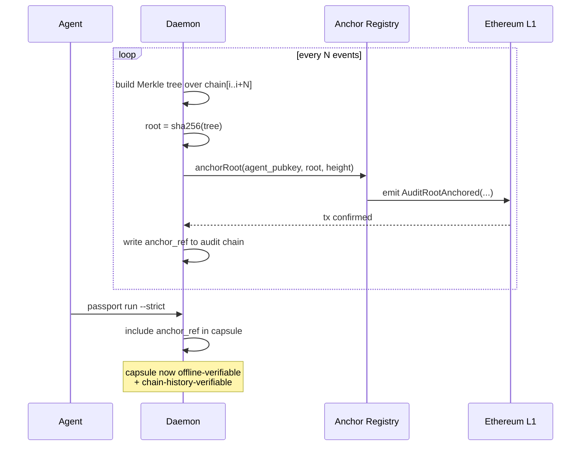

The local audit chain is tamper-evident **against the daemon's signing key**. On-chain anchoring extends that to **tamper-evident against ledger history** — anyone can verify a capsule's audit segment against a public root they didn't have to trust SBO3L for.

## What gets anchored

Every N events (configurable; default 100) the daemon computes a Merkle root over the most-recent contiguous chain slice and writes it to a registry contract on L1:



The anchor record carries: `agent_pubkey` (which agent), `root` (the Merkle root), `height` (chain length covered), `block_number`, `tx_hash`. These are the four fields a third-party verifier needs.

## How a verifier replays an anchor

Given a Passport capsule with an embedded `anchor_ref`:

1. Resolve the anchor record from L1 (`getAnchor(agent_pubkey, height)` — view function, no gas).
2. Recompute the Merkle root from the capsule's `audit_segment` plus the inclusion proof (also embedded).
3. Compare against the on-chain `root`.
4. If equal: the audit segment is part of the canonical chain at the time of anchoring. If different: tamper or replacement.

Steps 2–4 run inside `passport verify --strict --check-anchor`. The `--check-anchor` flag adds a 7th strict check on top of the existing 6 (see [capsule v2](/concepts/capsule#the-6-strict-mode-checks)). The CLI does the L1 RPC call against `SBO3L_ANCHOR_RPC_URL`; default mainnet, configurable for Sepolia smokes.

```bash
# Verify the embedded anchor against mainnet
sbo3l passport verify --strict --check-anchor --path capsule.json
# OK · 6 strict checks passed · anchor verified at block 19,234,567

# Same on Sepolia (for development)
SBO3L_ANCHOR_RPC_URL=https://ethereum-sepolia-rpc.publicnode.com \
  sbo3l passport verify --strict --check-anchor --path capsule.json
```

## Why this matters

Anchoring solves the **non-repudiation gap** in the local-only chain. Without an anchor, a daemon operator could in theory rewrite their own audit DB and sign over the rewrite. With an anchor, that requires also writing an alternate L1 history — practically impossible.

For regulated industries (custody, payments) this turns the SBO3L audit chain from "trust the daemon operator's signing discipline" into "trust the daemon operator OR Ethereum, whichever you trust more". Most compliance teams strongly prefer the latter.

## Cost + cadence

| Anchor cadence | Gas cost / month* | Trade-off |
|---|---|---|
| Every 100 events | ~$2-15 (mainnet) | tightest non-repudiation window; ~minutes-stale verification |
| Every 1k events | ~$0.20-1.50 (mainnet) | 10× cheaper; ~hour-stale window |
| L2 anchoring (Optimism / Base) | `<$0.01` | cheap; settles to L1 with 7-day finality |

*Assumes 2026-Q2 base-fee levels and 3 events/sec average.

For high-frequency agents, anchor to an L2 every 100 events; the L2 itself anchors to L1 on its own cadence, transitively giving you L1-grade finality at L2 cost.

## Source pointers

- Contract: `crates/sbo3l-anchor/contracts/AnchorRegistry.sol` (#245)
- Rust client: `crates/sbo3l-anchor/src/lib.rs` (#246) — `anchor_root()` + `verify_anchor()` functions
- Sepolia smoke: `bash demo-scripts/anchor-sepolia-smoke.sh` (broadcasts a real anchor tx; tx hash committed to `demo-scripts/artifacts/anchor-sepolia.json` after first run)
- CLI flag: `--check-anchor` on `passport verify` (Bob's CLI surface)

## See also

- [Audit log](/concepts/audit-log) — what each event contains; anchoring covers contiguous slices.
- [Self-contained capsule v2](/concepts/capsule) — the capsule already embeds the audit segment; anchoring adds the on-chain proof.
- [Audit replay](/concepts/audit-replay) — `--check-anchor` is the seventh check on top of the offline six.
