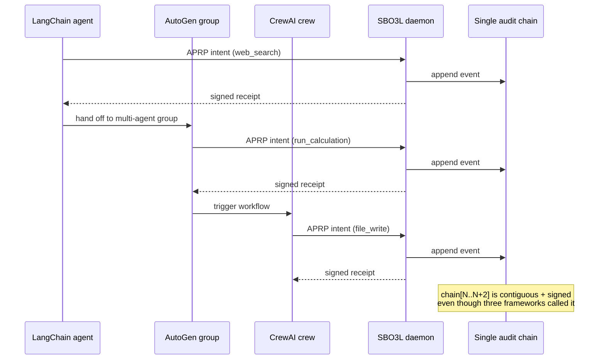

The same agent can call a LangChain tool, hand off to an AutoGen multi-agent group, then trigger a CrewAI workflow — and SBO3L records every decision in **one chain** signed by **one daemon key**. The framework boundary doesn't fragment the trust surface.

## Shipped adapters (14 total)

| Language | Framework | Crate / package |
|---|---|---|
| TS | `@sbo3l/sdk` | core SDK |
| TS | `@sbo3l/langchain` | LangChain JS |
| TS | `@sbo3l/autogen` | AutoGen JS |
| TS | `@sbo3l/elizaos` | ElizaOS plugin |
| TS | `@sbo3l/vercel-ai` | Vercel AI SDK |
| TS | `@sbo3l/marketplace` | marketplace registry client |
| Py | `sbo3l-sdk` | core Python SDK |
| Py | `sbo3l-langchain` | LangChain Py |
| Py | `sbo3l-crewai` | CrewAI |
| Py | `sbo3l-llamaindex` | LlamaIndex |
| Py | `sbo3l-langgraph` | LangGraph |
| Rust | `sbo3l-cli` | CLI |
| Rust | `sbo3l-mcp` | MCP server |
| Rust | `sbo3l-keeperhub-adapter` | KH guarded executor |

Each adapter is thin — it wraps the framework's tool/agent extension point and routes intent through the same `POST /v1/payment-requests` boundary.

## Single-chain property



Three calls, three frameworks, three signed receipts, **one contiguous audit chain**. A capsule emitted from any of the three calls embeds the chain segment up to that point — including the events from the OTHER two frameworks. Auditing the capsule shows the full cross-framework story.

This property is hard to achieve without SBO3L. The alternative — each framework keeping its own audit log — fragments verification: a capsule from CrewAI can't show the LangChain context because CrewAI doesn't have it. SBO3L makes the framework boundary irrelevant to verification.

## Why this matters for "wallet vs mandate"

The brand promise: *Don't give your agent a wallet. Give it a mandate.*

A wallet is a **single per-framework credential**: the LangChain agent has its keys, the AutoGen agent has different keys, neither knows about the other. Compromising one doesn't compromise the others, but auditing one tells you nothing about the others either.

A mandate (the SBO3L policy receipt) is **framework-agnostic**: the same agent identity binds across frameworks because the daemon is the source of truth, not any single framework's runtime. Compromising the agent's authority compromises it everywhere — but auditing one event reveals everything.

The 14-adapter coverage demonstrates this isn't a slogan. Every major TS + Py framework has a working SBO3L wrapper today, and a 10-step demo at [demo-scripts/cross-protocol-composition.sh](https://github.com/B2JK-Industry/SBO3L-ethglobal-openagents-2026/blob/main/demo-scripts/cross-protocol-composition.sh) walks through:

1. LangChain agent makes a `web_search` request → SBO3L allows.
2. Hands off to an AutoGen group → group asks for `run_calculation` → allow.
3. AutoGen invokes a CrewAI crew → crew asks for `file_write` → allow.
4. CrewAI's tool wraps a LlamaIndex query → SBO3L allow.
5. LlamaIndex result triggers a Vercel AI streaming completion → allow.
6. Stream output is parsed by a LangGraph state graph → allow.
7. State machine transitions trigger an ElizaOS plugin → allow.
8. ElizaOS asks for `pay vendor` → SBO3L denies (budget exceeded).
9. Audit chain export shows all 8 events under one chain head.
10. Strict-verify the resulting capsule offline → 6/6 green.

```bash
bash demo-scripts/cross-protocol-composition.sh
# 8 frameworks × 1 chain · final chain length: 8 events
# capsule emitted: capsule.json (size 12,847 bytes)
# strict verify: 6/6 checks passed · rc=0
```

## See also

- [APRP wire format](/concepts/aprp) — the envelope every adapter produces.
- [Audit log](/concepts/audit-log) — single-chain append guarantees.
- [Self-contained capsule v2](/concepts/capsule) — what cross-framework verification looks like in one JSON file.
- [Marketplace](/concepts/marketplace) — same composition story applied to policies.
