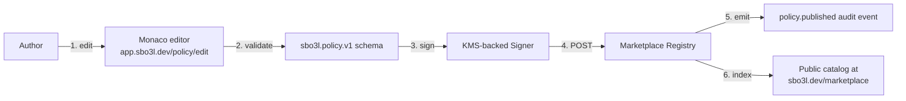

The marketplace turns SBO3L policies from per-deploy artefacts into a **shareable, signed, reputation-scored catalog**. Authors publish; adopters pin; reputation accrues from observed decision outcomes across the fleet.

## How a published policy is identified

Every marketplace policy is content-addressed:

```
policy_id = base32(sha256(JCS-canonical-policy-body))[:24]
```

Two policies with byte-identical bodies have the same `policy_id`. Republishing the same content does NOT create a new entry — it bumps the download count + reputation observation window for the existing entry.

## Publishing flow



The author never uploads a private key to the marketplace; the registry only sees the signed policy + the issuer's public key. Verification (step 5) checks the signature against an issuer registry derived from ENS — see [signing model](/concepts/signing) for where issuer keys live.

## Adoption flow

Adopters pin one line in their daemon's `policy.toml`:

```toml
[policy]
source = "sbo3l-marketplace"
id = "research-low-risk-sepolia"
version = "1.2.0"
trust = "by-reputation"   # or "pinned-hash" for stricter integrity
```

On next request:

1. Daemon fetches policy from the marketplace registry (cached locally).
2. Verifies issuer signature against the embedded `issuer_pubkey`.
3. Computes `policy_snapshot_hash` and starts using the policy.
4. Every Passport capsule from that point on embeds `policy_marketplace_id` so consumers can re-derive provenance.

## Trust modes

| Mode | What it means | When to use |
|---|---|---|
| `by-reputation` | Accept any policy version with reputation ≥ threshold | trust the marketplace operator + the issuer reputation system |
| `pinned-hash` | Lock to one specific policy_id; reject newer versions | regulated environments; explicit upgrade gates |
| `pinned-issuer` | Accept any version from a named issuer | trust issuer but want their improvements |

`by-reputation` is the default for community + hobby use; `pinned-hash` is recommended for production; `pinned-issuer` for partnered relationships.

## Five starter bundles (live today)

The marketplace ships with 5 seed policies authored by the SBO3L canonical issuer (`sbo3l.eth`):

| ID | Use case | Reputation |
|---|---|---|
| `research-low-risk-sepolia` | Sepolia testnet swaps for research agents | ★ 0.94 |
| `kh-workflow-strict` | KeeperHub workflow execution guard | ★ 0.89 |
| `uniswap-universal-router-v3` | Per-step Uniswap UR command guards | ★ 0.91 |
| `ens-subname-issuance` | Trust DNS fleet subname issuance limits | ★ 0.87 |
| `langchain-research-strict` | LangChain research agent tool gate | ★ 0.72 |

Browse them at [sbo3l-marketing.vercel.app/marketplace](https://sbo3l-marketing.vercel.app/marketplace).

## Reputation system

Each policy starts at score 0.50 (community baseline). Score evolves on three signals:

1. **Adoption count** — number of distinct daemon instances fetching the policy in the last 30 days.
2. **Decision outcome rate** — across observed daemons, the ratio of `allow` decisions to total decisions weighted by sponsor execution success (no broken sponsor calls).
3. **Cross-agent attestations** — peer agents publicly endorsing the policy via signed ENS attestations.

Score updates run hourly server-side; policy detail pages show the basis text alongside the score so adopters can audit how a number came to be.

## CLI

```bash
# Search the marketplace
sbo3l marketplace search "uniswap" --risk low
# uniswap-universal-router-v3 ★ 0.91 medium  by sbo3l.eth
# ...

# Inspect a policy without adopting
sbo3l marketplace show research-low-risk-sepolia
# version: 1.2.0  rules: 3  budgets: 3
# issuer: sbo3l.eth  reputation: 0.94
# basis: 60-agent constellation observation, T-3-4 4-criteria scoring

# Pin to your daemon
sbo3l marketplace adopt research-low-risk-sepolia --version 1.2.0
# Updated /etc/sbo3l/policy.toml; reload daemon to take effect
```

## Source pointers

- Registry SDK: `@sbo3l/marketplace` on npm (#244)
- UI: `apps/marketing/src/pages/marketplace/` (#241)
- Policy schema: `sbo3l.policy.v1` (see [policy decision](/concepts/policy))
- 5 seed policies: `apps/marketing/src/data/marketplace-policies.json`

## See also

[Policy decision](/concepts/policy) — what a policy contains. [Signing model](/concepts/signing) — issuer signature verification. [Trust DNS](/concepts/trust-dns) — issuer keys via ENS.
