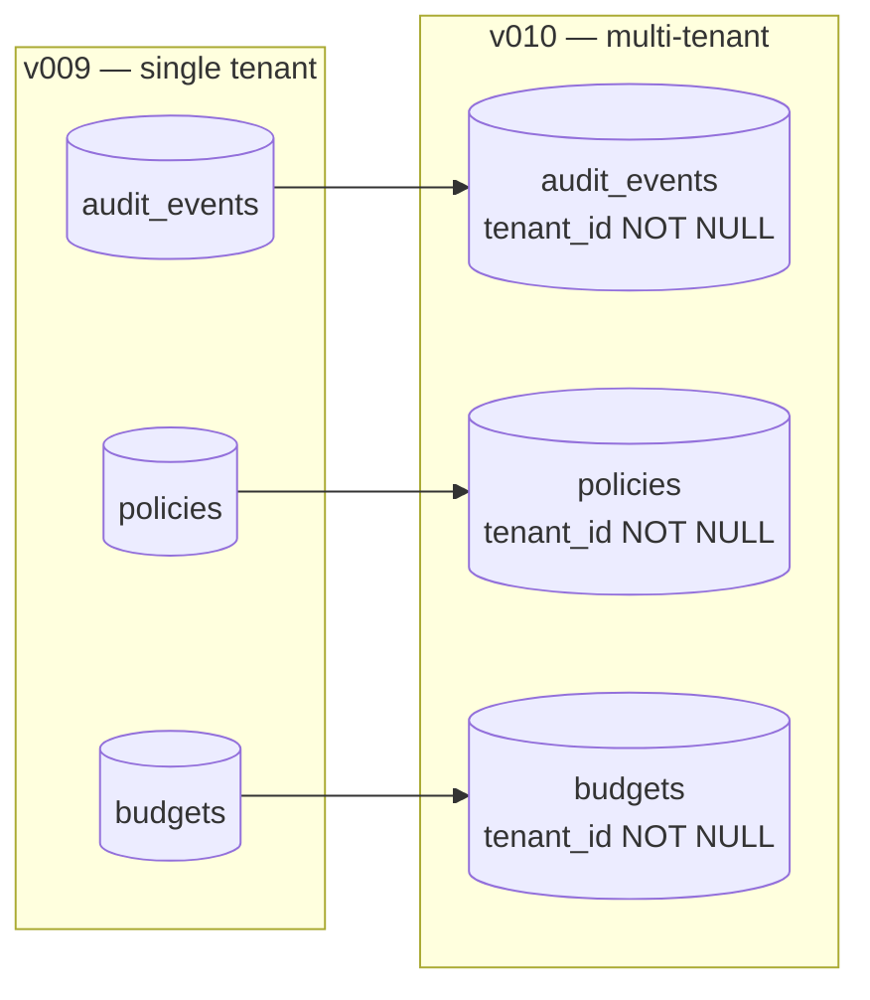

Phase 1 SBO3L was single-tenant: one daemon, one audit chain, one signing key. Phase 3.2 (V010 migration) makes a single daemon process serve **N tenants concurrently** with hard isolation.

## What changed in V010

V010 is the SQLite migration that adds a `tenant_id` column to every table. The migration is automatic on first daemon start after upgrade; it backfills `tenant_id = 'default'` for existing rows so single-tenant deployments are unaffected.



After V010:

- Every read goes through `audit_events_for_tenant(tenant_id)` etc. Cross-tenant queries do not exist as a code path.
- `tenant_id` is resolved from the request's `Authorization` header (JWT claim).
- Each tenant has its own signing-key entry in the `signers` table; the daemon's `Signer` trait is dispatch-by-tenant.
- ENS records publish under `<tenant>.sbo3lagent.eth` (subname per tenant) with agent subnames nested below: `agent-01.<tenant>.sbo3lagent.eth`.

## Isolation guarantees

Three layers, each enforced separately:

1. **Database layer** — every query passed through the `_for_tenant` function family. The function takes `tenant_id` as a non-optional argument; there is no overload that omits it. Code review enforces this; there are no plans to relax it.
2. **Signing layer** — `Signer::sign_for(tenant_id, payload)` looks up the tenant's configured signer and dispatches to it. A tenant signing with another tenant's key is a programming error caught at the dispatch site, not a runtime check.
3. **HTTP layer** — middleware validates the JWT, extracts `tenant_id`, and passes it explicitly into every handler. Handlers never read `tenant_id` from request bodies.

Combined effect: a confused-deputy attack would need to compromise the JWT-signing key, the daemon binary, AND the SQLite file on disk. Each layer is a separate failure to exploit; the whole stack is much stronger than any single layer.

## Operator surface

```bash
# Create a tenant
sbo3l admin tenant create acme-corp --tier pro --signer kms-aws --kms-key-id arn:...

# List tenants
sbo3l admin tenant list
# tenant_id    tier  agents  decisions/day  audit_chain_length
# default      pro   3       1,247          4,219
# acme-corp    pro   1       0              0
# research     free  2       127            942

# Suspend a tenant (read-only; new requests rejected)
sbo3l admin tenant suspend acme-corp --reason "billing"

# Forensic export: audit chain + signed receipts for one tenant
sbo3l audit export-bundle --tenant acme-corp --out acme.bundle
```

The hosted operator console at `app.sbo3l.dev/t/<tenant>/*` (CTI-3-5; design doc at [`docs/spec/CTI-3-5-operator-console.md`](https://github.com/B2JK-Industry/SBO3L-ethglobal-openagents-2026/blob/main/docs/spec/CTI-3-5-operator-console.md)) provides the same surface in a UI.

## Backward compatibility

Single-tenant operators upgrading from v009 → v010:

- Migration runs on first start; existing audit chains end up under `tenant_id = 'default'`.
- Existing API tokens continue to authenticate; the daemon synthesises `tenant_id = 'default'` from any token without the claim.
- Existing capsules verify unchanged — the strict verifier ignores `tenant_id` (it's about who's authorising, not who's verifying).

There is no rollback path from v010 → v009; the migration is one-way. Take a backup before upgrade.

## Source pointers

- Migration: `crates/sbo3l-storage/src/migrations/v010.rs` (#208)
- Per-tenant audit fns: `crates/sbo3l-storage/src/audit.rs` — search for `_for_tenant`
- Tenant management endpoints: `crates/sbo3l-server/src/handlers/admin_tenants.rs` (Dev 1 follow-up)
- Operator-console design: [`docs/spec/CTI-3-5-operator-console.md`](https://github.com/B2JK-Industry/SBO3L-ethglobal-openagents-2026/blob/main/docs/spec/CTI-3-5-operator-console.md)

## See also

- [Audit log](/concepts/audit-log) — per-tenant chains use the same hash-chain semantics.
- [Signing model](/concepts/signing) — per-tenant signers; KMS-backed in production.
