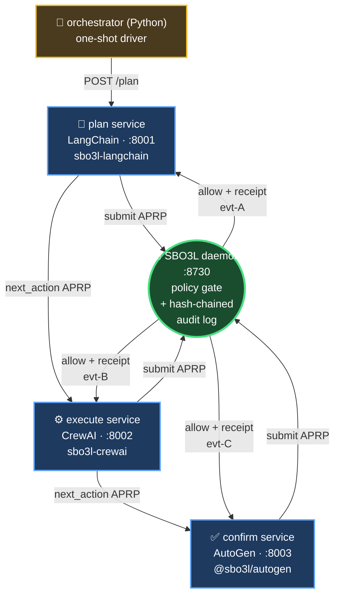

# `examples/multi-framework-agent` — cross-framework killer demo

> **Single agent. Three LLM frameworks. One SBO3L policy boundary. One hash-chained audit log.**

A single workflow walks LangChain → CrewAI → AutoGen, each gating its payment-shaped action through the SAME SBO3L daemon. The audit chain spans all three framework boundaries — proves SBO3L's "framework-agnostic trust layer" claim end-to-end.

## Architecture



> **The hash chain is what carries the trust:** `evt-A.hash → evt-B.prev_hash`, `evt-B.hash → evt-C.prev_hash`. Flip a single byte anywhere in the chain and `sbo3l passport verify --strict` rejects. *One* signed log spans *three* framework boundaries.

<details>
<summary>ASCII version (for terminals without mermaid)</summary>

```
                         ┌──────────────────────────────┐
                         │      orchestrator (Python)    │
                         └─────────────┬─────────────────┘
                                       │ HTTP POST /plan
                                       ▼
                         ┌──────────────────────────────┐
                         │   plan service (LangChain)    │ :8001
                         │  uses sbo3l-langchain         │
                         └─────────────┬─────────────────┘
                                       │ submit APRP
                                       ▼
                         ┌──────────────────────────────┐
                         │   ▶▶▶  SBO3L daemon  ◀◀◀     │ :8730
                         │  policy gate + audit append   │
                         └─────────────┬─────────────────┘
                                       │ allow + receipt
                                       │ next_action APRP
                                       ▼
   ┌──────────────────────────────┐   ▶▶ same daemon
   │  execute service (CrewAI)     │ :8002 ─▶ SBO3L (same audit log)
   │  uses sbo3l-crewai            │       │
   └─────────────┬─────────────────┘       │
                 │ next_action APRP        │
                 ▼                         │
   ┌──────────────────────────────┐        │
   │  confirm service (AutoGen)    │ :8003 ─▶ SBO3L (same audit log)
   │  uses @sbo3l/autogen          │
   └──────────────────────────────┘

   audit_event_id:    evt-A  ──▶  evt-B  ──▶  evt-C
   (LangChain step)        (CrewAI step)       (AutoGen step)
                ALL three live on the SAME hash-chained audit
                log inside the shared sbo3l-server container.
```

</details>

## Boot

```bash
cd examples/multi-framework-agent
docker compose up --build         # first time: ~3-5 min build
                                  # subsequent boots: <60s
```

In another terminal, run the orchestrator (single-shot):

```bash
docker compose --profile run run --rm orchestrator
```

You'll see (abridged):

```
═════════════════════════════════════════════════════════════
SBO3L cross-framework demo — single audit chain across 3 LLM frameworks
daemon: http://sbo3l-server:8730
goal:   Execute one paid API call and confirm the result.
═════════════════════════════════════════════════════════════

▶ step 1: plan (LangChain framework)
  decision:        allow
  audit_event_id:  evt-01HTAWX5K3R8YV9NQB7C6P2DGR
  execution_ref:   kh-01HTAWX5K3R8YV9NQB7C6P2DGS

▶ step 2: execute (CrewAI framework)
  decision:        allow
  audit_event_id:  evt-01HTAWX5K3R8YV9NQB7C6P2DGT
  execution_ref:   kh-01HTAWX5K3R8YV9NQB7C6P2DGU

▶ step 3: confirm (AutoGen framework)
  decision:        allow
  audit_event_id:  evt-01HTAWX5K3R8YV9NQB7C6P2DGV
  execution_ref:   kh-01HTAWX5K3R8YV9NQB7C6P2DGW

═════════════════════════════════════════════════════════════
✓ all 3 framework boundaries cleared SBO3L policy

Unified audit chain (single hash-chained log inside sbo3l-server):
[
  {"step": "plan",    "framework": "langchain", "audit_event_id": "evt-...",       "execution_ref": "kh-..."},
  {"step": "execute", "framework": "crewai",    "audit_event_id": "evt-...",       "execution_ref": "kh-..."},
  {"step": "confirm", "framework": "autogen",   "audit_event_id": "evt-...",       "execution_ref": "kh-..."}
]
```

## Walk the audit chain

```bash
docker compose exec sbo3l-server sbo3l-cli audit list \
  --from evt-... --to evt-...
```

The chain is hash-linked (each event's `prev_event_hash` points to the previous), so flipping a single byte in any of the three breaks the cryptographic verification — `sbo3l-cli passport verify --strict` rejects.

## Why this matters

- **Framework lock-in is dead.** Build with whichever LLM framework fits each step — SBO3L gates them all the same way.
- **Audit is unified.** No per-framework logs to reconcile. One signed log, hash-chained, walkable offline.
- **KH workflow `m4t4cnpmhv8qquce3bv3c`** is the live KeeperHub workflow each service ultimately routes to (the SBO3L daemon's KH adapter handles it, identical for all 3 framework boundaries).

## Per-service detail

| Service | Port | Framework | Integration package | Endpoint |
|---|---|---|---|---|
| `plan` | 8001 | LangChain | `sbo3l-langchain` (Python) | `POST /plan` |
| `execute` | 8002 | CrewAI | `sbo3l-crewai` (Python) | `POST /execute` |
| `confirm` | 8003 | AutoGen | `@sbo3l/autogen` (Node) | `POST /confirm` |
| `sbo3l-server` | 8730 | — | (the daemon) | full SBO3L API |
| `orchestrator` | — | — | — | one-shot Python script |

## Notes

- The plan and execute services depend on the `_coerce_to_dict()` patch to the Python integrations (also shipped in PRs #143/#148/#153) so `sbo3l_sdk.SBO3LClientSync.submit()`'s Pydantic response works through the integration's tool descriptor. Once those PRs merge, this demo's containers build identically.
- Each service uses the SBO3LClientSync via its native `httpx.Client` so it's hermetic and event-loop-safe.
- For an LLM-driven variant (each service runs a real LLM), set `OPENAI_API_KEY` in the docker-compose env section and add the optional extras to each service's pip install. The demo's deterministic mode (no LLM) is what runs in CI.

## License

MIT
